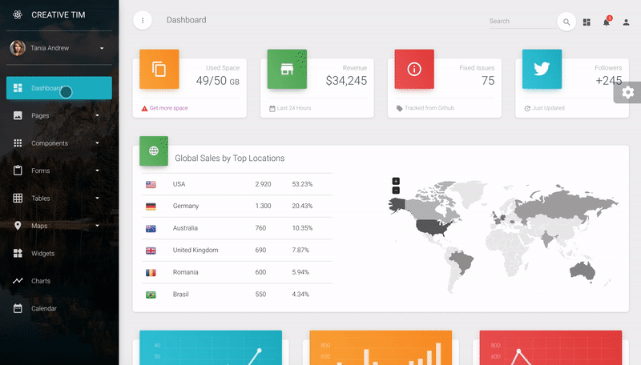

# [Material Dashboard PRO React](https://demos.creative-tim.com/material-dashboard-pro-react/#/dashboard) [](https://twitter.com/intent/tweet?url=https%3A%2F%2Fcreativetimofficial.github.io%2Fmaterial-dashboard-pro-react%2F%23%2Fdashboard&text=Material%20Dashboard%20PRO%20React%20-%20Premium%20Material-UI%20Admin%20Template&original_referer=https%3A%2F%2Fdemos.creative-tim.com%2Fmaterial-dashboard-pro-react%2F%3F_ga%3D2.234372891.44370326.1533641128-1803433978.1528781151&via=creativetim&hashtags=react%2Cmaterial-ui)


 [](https://github.com/creativetimofficial/ct-material-dashboard-pro-react/issues?q=is%3Aopen+is%3Aissue) [](https://github.com/creativetimofficial/ct-material-dashboard-pro/issues-react?q=is%3Aissue+is%3Aclosed) [](https://gitter.im/creative-tim/material-dashboard) [](https://discord.gg/E4aHAQy)



Material Dashboard PRO React is a Premium Material-UI Admin with a fresh, new design inspired by Google's Material Design. We are very excited to introduce our take on the material concepts through an easy to use and beautiful set of components. Material Dashboard PRO React was built over the popular Material-UI framework.

Material Dashboard PRO React makes use of light, surface and movement. The general layout resembles sheets of paper following multiple different layers, so that the depth and order is obvious. The navigation stays mainly on the left sidebar and the content is on the right inside the main panel.

Material Dashboard PRO React comes with 7 color filter choices for the links of the Sidebar (`blue`, `green`, `orange`, `red`, `purple`, `rose`, `white`), 3 filter color choices for background of the Sidebar (`white`, `blue`, `black`), an option to have a background image on the Sidebar and 6 color filter choices the card headers (`blue`, `green`, `orange`, `red`, `purple`, `rose`).

Material Dashboard PRO React uses a framework built by our friend [Olivier - Material-UI](https://github.com/mui-org/material-ui), who did an amazing job creating the backbone for the material effects, animations, ripples and transitions. Big thanks to his team for the effort and forward thinking they put into it.

#### Special thanks
During the development of this dashboard, we have used many existing resources from awesome developers. We want to thank them for providing their tools open source:
+ [Perfect-scrollbar](https://github.com/utatti/perfect-scrollbar) for the slim and beautiful scrollbars.
+ [React-chartist](https://github.com/fraserxu/react-chartist) for the wonderful charts.
+ [React-datetime](https://github.com/YouCanBookMe/react-datetime) for the easy to use date and time pickers.
+ [React-big-calendar](https://github.com/intljusticemission/react-big-calendar) for the a wonderful calendar.
+ [React-bootstrap-sweetalert](https://github.com/djorg83/react-bootstrap-sweetalert) for the wonderful alerts.
+ [React-google-maps](https://github.com/tomchentw/react-google-maps) for the nice and easy to use map components.
+ [React-jvectormap](https://github.com/kadoshms/react-jvectormap) for the nice vector map components.
+ [React-nouislider](https://github.com/algolia/react-nouislider) for the nice and clean slider.
+ [React-tables](https://react-table.js.org/#/story/simple-table) for the nice and clean slider.
+ [React-tagsinput](https://github.com/olahol/react-tagsinput) for the easy and beatiful to use tags components.

Let us know your thoughts below. And good luck with development!

## Table of Contents

* [Versions](#versions)
* [Demo](#demo)
* [Quick Start](#quick-start)
* [Documentation](#documentation)
* [File Structure](#file-structure)
* [Browser Support](#browser-support)
* [Resources](#resources)
* [Reporting Issues](#reporting-issues)
* [Technical Support or Questions](#technical-support-or-questions)
* [Licensing](#licensing)
* [Useful Links](#useful-links)


## Versions

[](https://www.creative-tim.com/product/material-dashboard-pro)
[](https://www.creative-tim.com/product/material-dashboard-pro-react)
[](https://www.creative-tim.com/product/vue-material-dashboard-pro)
[](https://www.creative-tim.com/product/material-dashboard-pro-angular2)


| HTML | React | Vue | Angular |
| --- | --- | --- | --- |
| [](https://www.creative-tim.com/product/material-dashboard-pro) | [](https://www.creative-tim.com/product/material-dashboard-pro-react)  | [](https://www.creative-tim.com/product/vue-material-dashboard-pro)  | [](https://www.creative-tim.com/product/material-dashboard-pro-angular2)

## Demo

- [Start page](https://demos.creative-tim.com/material-dashboard-pro-react/#/dashboard)
- [User profile page](https://demos.creative-tim.com/material-dashboard-pro-react/#/user-page)
- [Tables page ](https://demos.creative-tim.com/material-dashboard-pro-react/#/tables/extended-tables)
- [Maps Page](https://demos.creative-tim.com/material-dashboard-pro-react/#/maps/google-maps)
- [Notifications page](https://demos.creative-tim.com/material-dashboard-pro-react/#/components/notifications)

[View More](https://demos.creative-tim.com/material-dashboard-pro-react/#/dashboard).


## Quick start

Quick start options:

- Buy from [Creative Tim](https://www.creative-tim.com/product/material-dashboard-pro-react)


## Documentation
The documentation for the Material Dashboard Pro is hosted at our [website](https://demos.creative-tim.com/material-dashboard-pro-react/#/documentation/tutorial).


## File Structure

Within the download you'll find the following directories and files:

```
material-dashboard-pro-react
│
├── CHANGELOG.md
├── README.md
├── documentation
│   ├── assets
│   │   ├── css
│   │   ├── img
│   │   │   └── faces
│   │   └── js
│   └── tutorial-components.html
├── package.json
├── public
│   ├── favicon.ico
│   ├── index.html
│   └── manifest.json
└── src
    ├── assets
    │   ├── img
    │   │   ├── faces
    │   │   ├── flags
    │   │   └── logo-white.svg
    │   ├── jss
    │   │   ├── material-dashboard-pro-react
    │   │   │   ├── components
    │   │   │   ├── layouts
    │   │   │   └── views
    │   │   └── material-dashboard-pro-react.jsx
    │   └── scss
    │       ├── material-dashboard-pro-react
    │       │   ├── mixins
    │       │   └── plugins
    │       └── material-dashboard-pro-react.scss
    ├── components
    │   ├── Accordion
    │   │   └── Accordion.jsx
    │   ├── Badge
    │   │   └── Badge.jsx
    │   ├── Card
    │   │   ├── Card.jsx
    │   │   ├── CardAvatar.jsx
    │   │   ├── CardBody.jsx
    │   │   ├── CardFooter.jsx
    │   │   ├── CardHeader.jsx
    │   │   ├── CardIcon.jsx
    │   │   └── CardText.jsx
    │   ├── Clearfix
    │   │   └── Clearfix.jsx
    │   ├── CustomButtons
    │   │   └── Button.jsx
    │   ├── CustomDropdown
    │   │   └── CustomDropdown.jsx
    │   ├── CustomInput
    │   │   └── CustomInput.jsx
    │   ├── CustomLinearProgress
    │   │   └── CustomLinearProgress.jsx
    │   ├── CustomTabs
    │   │   └── CustomTabs.jsx
    │   ├── CustomUpload
    │   │   ├── ImageUpload.jsx
    │   │   └── PictureUpload.jsx
    │   ├── Footer
    │   │   └── Footer.jsx
    │   ├── Grid
    │   │   ├── GridContainer.jsx
    │   │   └── GridItem.jsx
    │   ├── Header
    │   │   ├── Header.jsx
    │   │   ├── HeaderLinks.jsx
    │   │   └── PagesHeader.jsx
    │   ├── Heading
    │   │   └── Heading.jsx
    │   ├── InfoArea
    │   │   └── InfoArea.jsx
    │   ├── Instruction
    │   │   └── Instruction.jsx
    │   ├── NavPills
    │   │   └── NavPills.jsx
    │   ├── Pagination
    │   │   └── Pagination.jsx
    │   ├── Sidebar
    │   │   └── Sidebar.jsx
    │   ├── Snackbar
    │   │   ├── Snackbar.jsx
    │   │   └── SnackbarContent.jsx
    │   ├── Table
    │   │   └── Table.jsx
    │   ├── Tasks
    │   │   └── Tasks.jsx
    │   ├── Timeline
    │   │   └── Timeline.jsx
    │   ├── Typography
    │   │   ├── Danger.jsx
    │   │   ├── Info.jsx
    │   │   ├── Muted.jsx
    │   │   ├── Primary.jsx
    │   │   ├── Quote.jsx
    │   │   ├── Success.jsx
    │   │   └── Warning.jsx
    │   └── Wizard
    │       └── Wizard.jsx
    ├── index.js
    ├── layouts
    │   ├── Dashboard.jsx
    │   ├── Pages.jsx
    │   └── RTL.jsx
    ├── routes
    │   ├── dashboard.jsx
    │   ├── index.jsx
    │   ├── pages.jsx
    │   └── rtl.jsx
    ├── variables
    │   ├── charts.jsx
    │   └── general.jsx
    └── views
        ├── Calendar
        │   └── Calendar.jsx
        ├── Charts
        │   └── Charts.jsx
        ├── Components
        │   ├── Buttons.jsx
        │   ├── GridSystem.jsx
        │   ├── Icons.jsx
        │   ├── Notifications.jsx
        │   ├── Panels.jsx
        │   ├── SweetAlert.jsx
        │   └── Typography.jsx
        ├── Dashboard
        │   └── Dashboard.jsx
        ├── Forms
        │   ├── ExtendedForms.jsx
        │   ├── RegularForms.jsx
        │   ├── ValidationForms.jsx
        │   ├── Wizard.jsx
        │   └── WizardSteps
        │       ├── Step1.jsx
        │       ├── Step2.jsx
        │       └── Step3.jsx
        ├── Maps
        │   ├── FullScreenMap.jsx
        │   ├── GoogleMaps.jsx
        │   └── VectorMap.jsx
        ├── Pages
        │   ├── LockScreenPage.jsx
        │   ├── LoginPage.jsx
        │   ├── PricingPage.jsx
        │   ├── RTLSupport.jsx
        │   ├── RegisterPage.jsx
        │   ├── Timeline.jsx
        │   └── UserProfile.jsx
        ├── Tables
        │   ├── ExtendedTables.jsx
        │   ├── ReactTables.jsx
        │   └── RegularTables.jsx
        └── Widgets
            └── Widgets.jsx
```

## Browser Support

At present, we officially aim to support the last two versions of the following browsers:

    


## Resources
- [Live Preview](https://demos.creative-tim.com/material-dashboard-pro-react/#/dashboard)
- Buy Page: https://www.creative-tim.com/product/material-dashboard-pro-react
- Documentation is [here](https://demos.creative-tim.com/material-dashboard-pro-react/#/documentation/tutorial)
- License Agreement: https://www.creative-tim.com/license
- Support: https://www.creative-tim.com/contact-us
- Issues: [Github Issues Page](https://github.com/creativetimofficial/ct-material-dashboard-pro-react/issues)
- Material Dashboard React - [demo](https://www.creative-tim.com/product/material-dashboard-react?ref=github-md-pro-react)
- For Front End Development - [Material Kit Pro React ](https://www.creative-tim.com/product/material-kit-pro-react?ref=github-md-pro-react)

## Reporting Issues
We use GitHub Issues as the official bug tracker for the Material Dashboard Pro. Here are some advices for our users that want to report an issue:

1. Make sure that you are using the latest version of the Material Dashboard Pro. Check the CHANGELOG from your dashboard on our [website](https://www.creative-tim.com/).
2. Providing us reproducible steps for the issue will shorten the time it takes for it to be fixed.
3. Some issues may be browser specific, so specifying in what browser you encountered the issue might help.

## Technical Support or Questions

If you have questions or need help integrating the product please [contact us](https://www.creative-tim.com/contact-us) instead of opening an issue.

## Licensing

- Copyright 2018 Creative Tim (https://www.creative-tim.com)
- Creative Tim [license](https://www.creative-tim.com/license)

## Useful Links

 - [More products](https://www.creative-tim.com/bootstrap-themes) from Creative Tim

- [Tutorials](https://www.youtube.com/channel/UCVyTG4sCw-rOvB9oHkzZD1w)

- [Freebies](https://www.creative-tim.com/bootstrap-themes/free) from Creative Tim

- [Affiliate Program](https://www.creative-tim.com/affiliates/new) (earn money)

##### Social Media

Twitter: <https://twitter.com/CreativeTim>

Facebook: <https://www.facebook.com/CreativeTim>

Dribbble: <https://dribbble.com/creativetim>

Google+: <https://plus.google.com/+CreativetimPage>

Instagram: <https://instagram.com/creativetimofficial>
